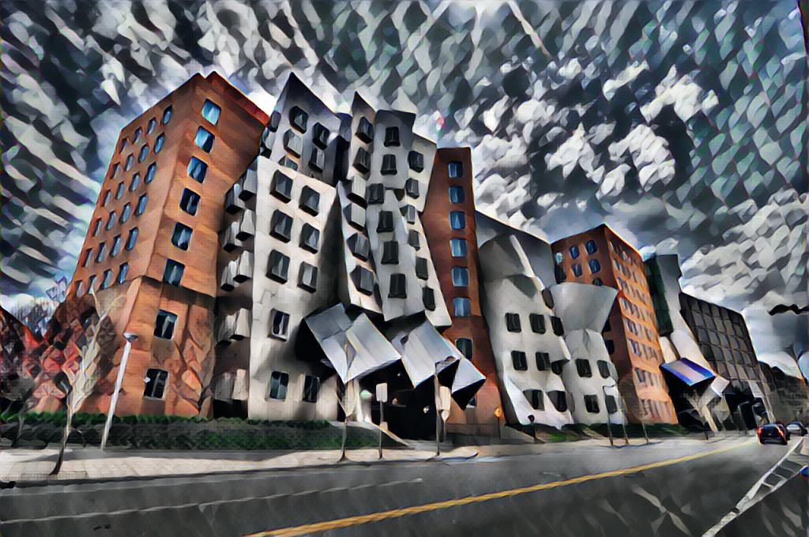
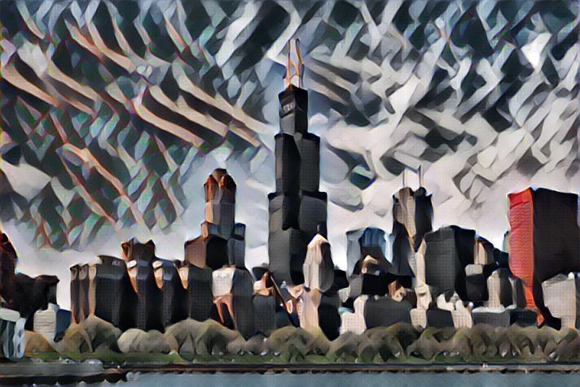

We implement a fast style transfer algorithm based on [Perceptual Losses for Real-Time Style Transfer and Super-Resolution]

Although this algorithm is traiend with (256, 256, 3) images, it generalizes extremly well with high-dimensional image at test time. Once you train the network, you can run eval.py to try different scale images.

## Examples

## Reference Papers

Justin Johnson et al. Perceptual Losses for Real-Time Style Transfer and Super-Resolution

## Reference Code

https://github.com/lengstrom/fast-style-transfer