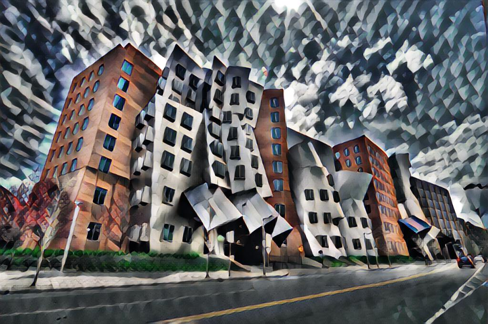

Fast style transfer based on [Perceptual Losses for Real-Time Style Transfer and Super-Resolution](ref1) and [Instance Normalization](#ref2)

Although this algorithm is traiend with (256, 256, 3) images, it generalizes extremly well with high-dimensional image at test time. Once you train the network, feel free to run `eval.py` to try different scale images.

Code is tested with Python 3.7.3 and Tensorflow 1.13.1

```python
""" Examplary Code """
python train.py
python eval.py -i=path_to_image -c=path_to_checkpoint
```

## Monitor Training

To monitor your training info, please open tensorboard with `tensorboard --logdir=logs`

## Examples

<p align = 'center'>


<a href = 'data/results/stata-udnie.jpg'></a>
</p>
<p align = 'center'>

<p align = 'center'>


<a href = 'data/results/chicago-udnie.jpg'></a>
</p>
<p align = 'center'>

For more example, see `data/results`.

## Reference Papers

<a name='ref1'></a>Justin Johnson et al. Perceptual Losses for Real-Time Style Transfer and Super-Resolution

<a name='ref2'></a>Dmitry Ulyanov et al. Instance Normalization: The Missing Ingredient for Fast Stylization

## Reference Code

https://github.com/lengstrom/fast-style-transfer