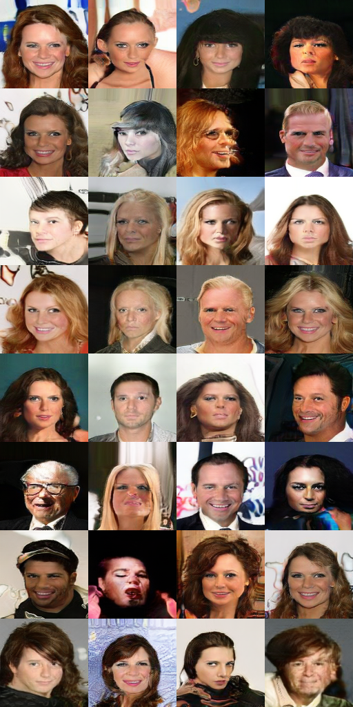
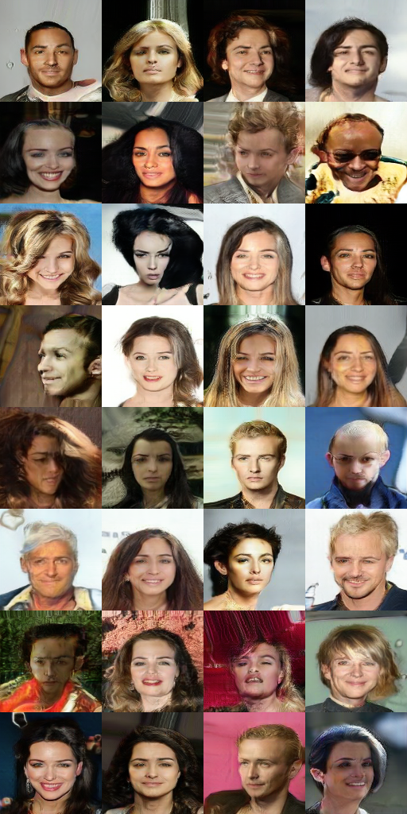

## Algorithms Implemented

- [x] Self-Attention                    [[paper](#ref1)][[code](https://github.com/xlnwel/cv/blob/38d5e7a4874538cf3809127c126735265f4a2129/basic_model/layer.py#L418)]
- [x] Spectral Normalization            [[paper](#ref2)][[code](https://github.com/xlnwel/cv/blob/38d5e7a4874538cf3809127c126735265f4a2129/utility/tf_utils.py#L157)]
- [x] Hinge Loss                        [[code](https://github.com/xlnwel/cv/blob/38d5e7a4874538cf3809127c126735265f4a2129/algo/sagan/model.py#L125)]
- [x] TTUR                              [[paper](#ref3)][[code](https://github.com/xlnwel/cv/blob/38d5e7a4874538cf3809127c126735265f4a2129/algo/sagan/args.yaml#L19)]
- [x] Conditional Batch Normalization   [[paper](#ref5)][[code](https://github.com/xlnwel/cv/blob/38d5e7a4874538cf3809127c126735265f4a2129/layers/cbn.py#L4)]
- [x] Projection Discriminator          [[paper](ref6)][[code](https://github.com/xlnwel/cv/blob/38d5e7a4874538cf3809127c126735265f4a2129/algo/sagan/networks.py#L186)]
- [x] resize for upsampling             [[code](https://github.com/xlnwel/cv/blob/38d5e7a4874538cf3809127c126735265f4a2129/algo/sagan/networks.py#L69)]

Conditional batch normalization and projection discriminator are conditioned on labels. However, since I haven't found a suitable dataset with labels(ImageNet is intimidatingly large and requires a specific email), they are not tested yet. But the implementation should(or maybe- -.) be correct.

## Results

The algorithm is still under training. Following figures show the results at 93500 and 94000 iterations

## Monitor Training

To monitor your training info, please open tensorboard with `tensorboard --logdir=logs`

## References

1. Self Attention: Han Zhang et al. Self-Attention Generative Adversarial Networks. In PMLR 2019.

2. Spectral Normalization(SN): Miyato, T., Kataoka, T., Koyama, M., and Yoshida, Y. Spectral normalization for generative adversarial networks. In ICLR, 2018.

3. Two-Timescale Update Rule (TTUR): Heusel, M., Ramsauer, H., Unterthiner, T., Nessler, B., and Hochreiter, S. GANs trained by a two time-scale update rule converge to a local nash equilibrium. In NIPS, pp. 6629–6640, 2017.

4. Spectral Norm Regularization: Yuichi Yoshida et al. Spectral Norm Regularization for Improving the Generalizability of Deep Learning

5. Conditional Batch Normalization (CBN): Harm de Vries, Florian Strub, J´er´emie Mary, Hugo Larochelle, Olivier Pietquin, and Aaron C Courville. Modulating early visual processing by language. In NIPS, pp. 6576–6586, 2017.

6. Projection Discriminator: Takeru Miyato et al. cGANs With Projection Discriminator

Resize vs Deconvolution: https://distill.pub/2016/deconv-checkerboard/

## Code Reference